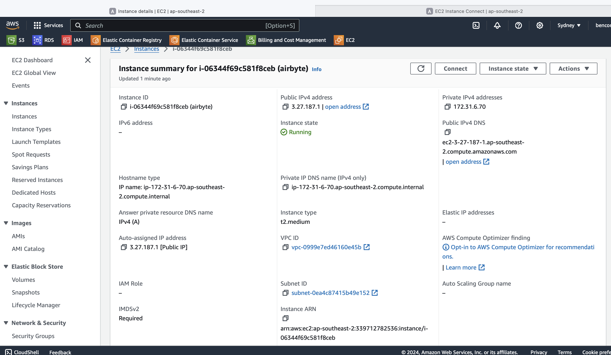
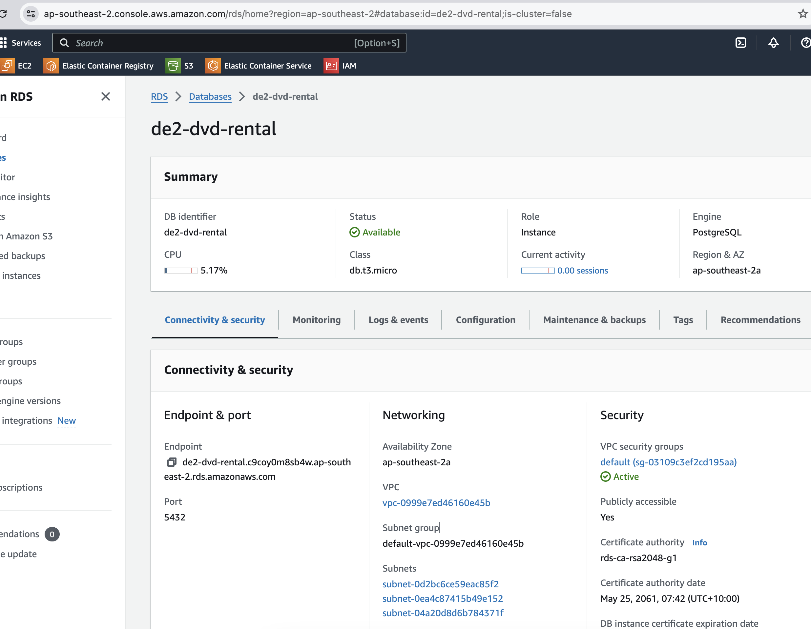
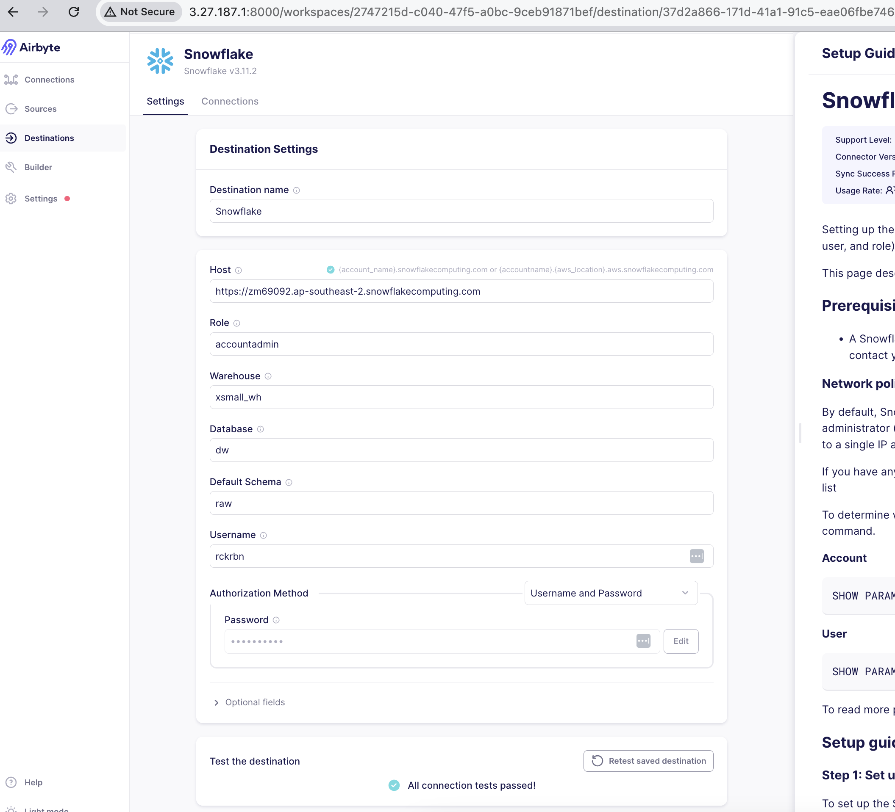
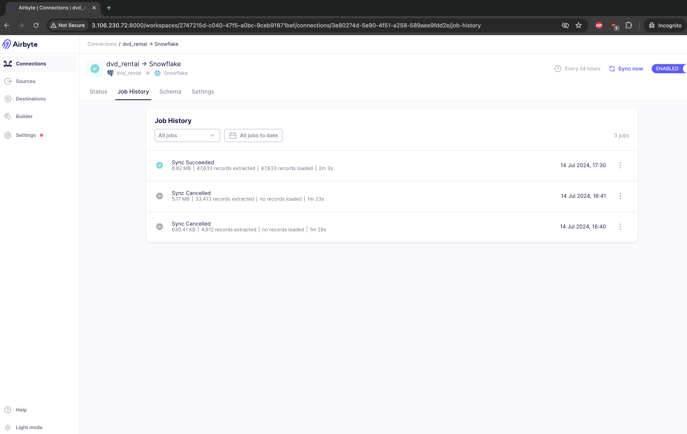
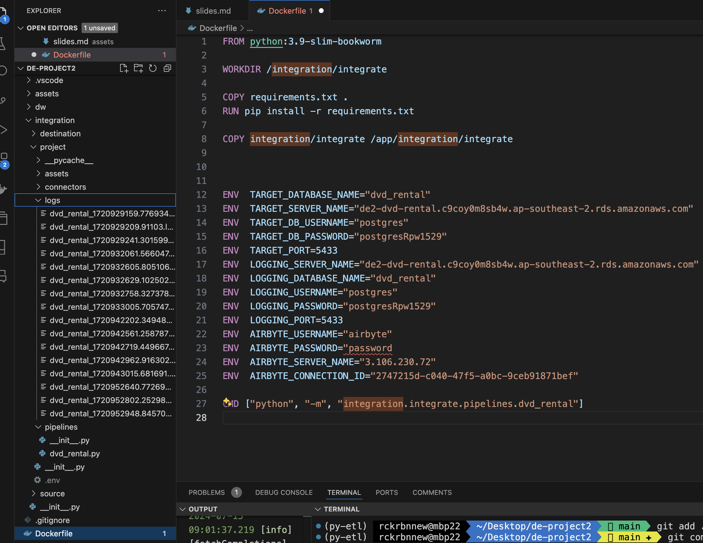
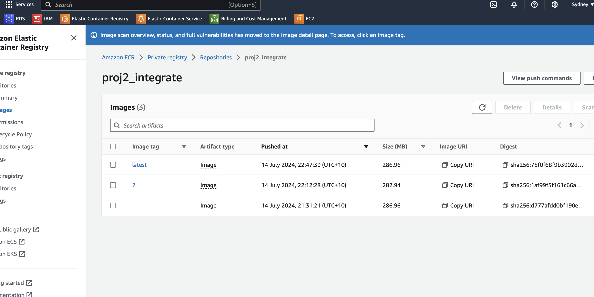
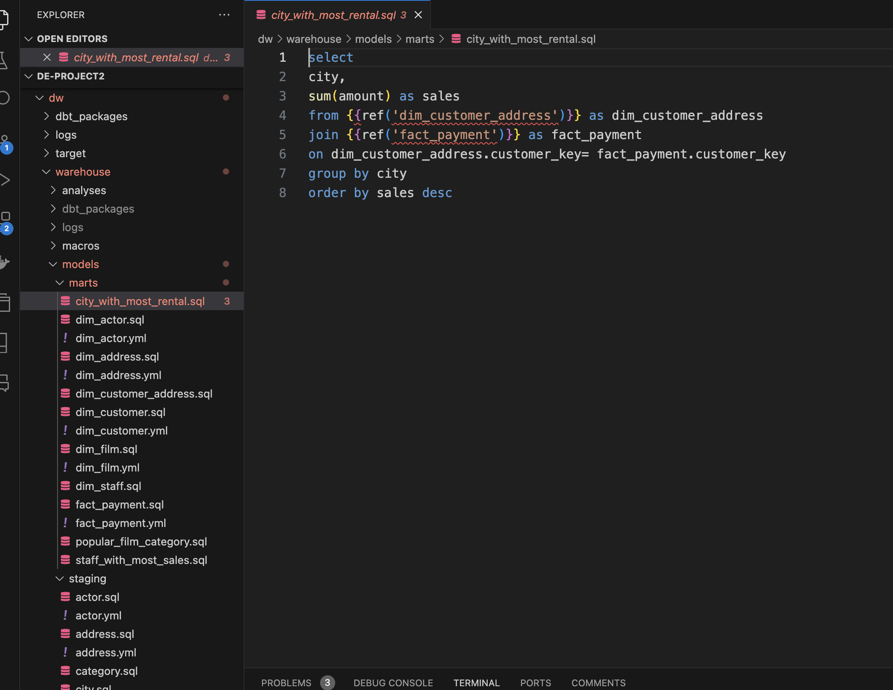

# Project 2 - ELT pipeline

| Authors                                               |
| ----------------------------------------------------- |
| Ben - [rockerben](https://github.com/rockerben)       |
| Emily - [ZhiwenSong1](https://github.com/ZhiwenSong1) |

---

# Objective

DVDRental: where DVD dreams come true for a dedicated cult following nationwide! Despite a recent plot twist of declining fortunes, our management is on a quest for insights to boost promotions and profits.

Our mission? Serving up juicy analytical datasets to our management and BI team, so they can craft dashboards that’ll have decisions made faster than you can hit "play".

---

# Consumers

- The dataset consumers are our resident data wizards (Data Analysts) and the BI brainiacs. They're conjuring up BI dashboards that'll make revenue changes as clear as a rom-com ending. Then, they'll dazzle senior management with insights so sharp, they'll think we’ve finally cracked the DVD rental code!

---

# Questions

Management seeks the following information to improve promotions and increase profits:

- The most popular film categories.
- The cities where customers are most likely to rent DVDs.
- The staff members with the highest DVD rentals, to be recognized at annual events.

---

# Data sources

The datasets are from DVDRental, where our PostgreSQL server runs a daily "DVD-livery" service!

---

# Solution architecture

---

# Proof of Work

1. **Install Airbyte on EC2**
   

2. **Create a Postgres RDS**
   
3. **Create Airbyte Connection to Snowflake**
   
4. **Test Extract/Load**

   1. **Airbyte UI**
      

   2. **Airbyte API (Python project)**
      

5. **Build containers**
   
6. **Trigger the ECS (manual test)**
   
7. **DBT Modelling**
   
8. DBT Python Config
   

9. Run Pipeline (set schedules)
   

---

# GIT

- [GIT Repository](https://github.com/rockerben/de-project2)

- Activity (2 branches, 5 merged pull requests and ~35 commits)

---

## Tasks

| ELT Pipeline |
| ------------ |

1. Time management
2. Install Airbyte on EC2
3. Create an Airbyte connection to Snowflake
4. Create a Postgres RDS
5. Airbyte API (using Python) - ECR, ECS to Extract and Load
6. Test Python engine
7. Develop Snowflake/DBT Tasks
8. DBT run (using Python) ECR, ECS to Transform
9. Pipeline Testing

| Project Delivery |
| ---------------- |

1. Setup and clean Scaffold
2. Solution Architecture
3. Project Presentation Materials
